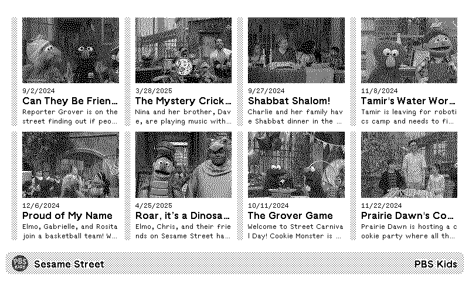

# PBS Kids for TRMNL

[](https://github.com/stephenyeargin/trmnl-pbs-kids/actions/workflows/build.yml)


## Screenshots



## Development

### Updating Show Options

The show options in `src/settings.yml` can be automatically updated using the included script:

```bash
./bin/update_shows
```

This script:
1. Fetches the latest show data from `https://producerplayer.services.pbskids.org/show-tracking`
2. Creates a backup of the current `settings.yml` file
3. Updates the `pbs_kids_show_id` field options with the latest shows as key-value pairs (`title: slug`)
4. Sorts shows alphabetically by title
5. Saves the updated settings

The script automatically creates a timestamped backup of the original settings file before making changes. Backups are stored in the same directory as the settings file with the format `settings.yml.backup.YYYYMMDD_HHMMSS`.

**Requirements:**
- Ruby (built-in libraries only)
- Internet connection to fetch data from PBS Kids API

### Releasing

This project uses automated releases based on the `VERSION` file. To create a new release:

1. Update the version using the bump script:
   ```bash
   ./bin/bump-version [major|minor|patch]
   ```

2. Commit and push the version change:
   ```bash
   git add VERSION
   git commit -m "Bump version to X.Y.Z"
   git push origin main
   ```

3. The GitHub Action will automatically:
   - Create a git tag for the new version
   - Generate release notes from commits
   - Create a GitHub release
   - Deploy to TRMNL using `trmnlp push`

### Manual Development

For local development and testing:

```bash
# Run development server
./bin/dev

# Push to TRMNL (requires API key configuration)
trmnlp push
```
